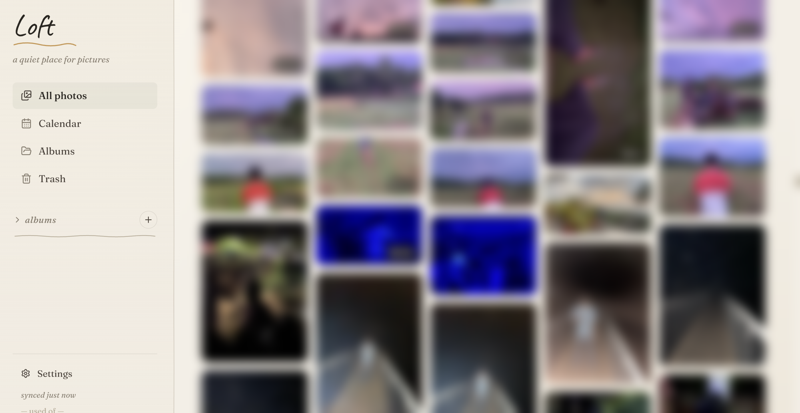

# Loft

A personal, single-user **photo + video gallery** ("loft") that runs almost entirely on Cloudflare's free tier — target cost **~$0–3/month**. Upload from any device, browse a fast masonry timeline, organize into albums, and install it as a PWA on your phone or desktop.

> Loft is intentionally **single-user and private**: the whole app sits behind Cloudflare Access locked to one email. It is not a multi-tenant product — it's a self-hosted loft for *your* memories.

<!-- Add a screenshot or GIF here once you have one:

-->

## Highlights

- **Browser-side image pipeline** — thumbnails and previews are generated in your browser (OffscreenCanvas / WebCodecs). The Worker does zero image processing, so it stays on the free tier.
- **Single Cloudflare Worker** serves both the React SPA *and* the API from the same origin (no separate Pages project) — which sidesteps iOS Safari's cross-site cookie blocking for auth.
- **Offline-friendly PWA** — installable, with a Dexie (IndexedDB) mirror of your library and a 60s delta-sync so multiple devices stay in step.
- **Real video thumbnails** — first keyframe decoded via WebCodecs + mp4box (honoring rotation), with a hidden-`<video>` fallback. Dark intro frames are skipped so thumbnails aren't black.
- **EXIF-aware** — capture date, dimensions, and GPS are read client-side via `exifr`.
- **Soft delete + trash** with a daily cron that purges items older than 30 days.

## Architecture

```
                      ┌─────────────────────────────────────────┐
   Browser  ──────▶   │   Cloudflare Worker  "loft-api"          │
   (React PWA)        │   (Hono, TypeScript)                     │
                      │                                          │
                      │   [assets]  →  serves web/dist (SPA)     │
                      │   /api/*    →  JSON API                  │
                      │   /img/*    →  R2 image serving          │
                      └───────┬───────────────────┬──────────────┘
                              │                   │
                        ┌─────▼─────┐       ┌─────▼─────┐
                        │  R2       │       │  D1       │
                        │  (blobs:  │       │  (SQLite: │
                        │  orig/    │       │  photos,  │
                        │  preview/ │       │  albums)  │
                        │  thumb/)  │       └───────────┘
                        └───────────┘
                  All wrapped by Cloudflare Access (single-email policy)
```

**One Worker, same origin.** The frontend static assets and the API live in the same Worker so the browser only ever talks to one domain. This is deliberate — splitting into Cloudflare Pages + a separate API Worker reintroduces the cross-site cookie problem that breaks Cloudflare Access on iOS Safari.

| Layer | Tech |
|---|---|
| Storage | Cloudflare R2 (single bucket; `orig/`, `preview/`, `thumb/` are key prefixes) |
| Database | Cloudflare D1 (SQLite) |
| Backend + host | One Cloudflare Worker — TypeScript + [Hono](https://hono.dev) |
| Frontend | React 18 + Vite + TypeScript + Tailwind v3 + Radix UI + Framer Motion + React Router + Dexie |
| Auth | Cloudflare Access (Google login, single-email policy) |
| PWA | vite-plugin-pwa (service worker + web manifest) |

## Repo layout

This is an npm-workspaces monorepo:

```
loft/
├── shared/    Types shared between web + worker (src/types.ts)
├── workers/   Cloudflare Worker — API + static-asset host
│   ├── wrangler.toml      Bindings (R2/D1), [assets], daily cron
│   ├── migrations/        D1 SQL migrations
│   └── src/               Hono app, routes, auth, lib
└── web/       React PWA frontend (built to web/dist, served by the Worker)
    └── src/   routes, components, Dexie schema, sync, image pipeline
```

## Prerequisites

- **Node.js 22** (see `.nvmrc`) and npm
- A **Cloudflare account** (the free tier is enough to start)
- [`wrangler`](https://developers.cloudflare.com/workers/wrangler/) — installed automatically as a dev dependency

## Local development

Miniflare simulates R2 + D1 locally, so you can develop fully offline without touching your Cloudflare account.

```bash
npm install

# Apply DB migrations to the local (simulated) D1
npm run db:migrate:local

# Run in two terminals:
npm run dev:api    # Worker on http://localhost:8787  (miniflare, local R2 + D1)
npm run dev:web    # Vite on  http://localhost:5173
```

Open **http://localhost:5173**. In dev, Vite proxies `/api` and `/img` to the Worker on `:8787`, and Cloudflare Access auth is bypassed (`ENV = "dev"`).

```bash
npm run typecheck  # typecheck all workspaces
```

## Deploy to Cloudflare

```bash
# 1. Authenticate wrangler with your Cloudflare account
npx wrangler login

# 2. Create the R2 buckets
#    (loft-preview is only used for `wrangler dev --remote` previews)
npx wrangler r2 bucket create loft
npx wrangler r2 bucket create loft-preview

# 3. Create the D1 database, then paste the printed database_id
#    into workers/wrangler.toml  (replace YOUR_D1_DATABASE_ID)
npx wrangler d1 create loft-db

# 4. Set your allowed email in workers/wrangler.toml
#    [vars] ALLOWED_EMAIL = "you@example.com"

# 5. Apply migrations to production D1
npm run db:migrate:remote

# 6. Build the frontend + deploy the Worker (with the static assets)
npm run deploy
```

Then, in the Cloudflare dashboard:

7. **Zero Trust → Access → Applications** → add a self-hosted app wrapping your Worker domain (`loft-api.<your-subdomain>.workers.dev`), with a policy allowing only your email. This is what makes the loft private.

### Notes on configuration

- **`account_id`** is read from the `CLOUDFLARE_ACCOUNT_ID` environment variable (or auto-detected from `wrangler login`). It's commented out in `wrangler.toml`; set it only if your login has multiple accounts.
- **`database_id`** must be a literal in `wrangler.toml` — Wrangler does not interpolate env vars into binding IDs. Paste the id from step 3.
- **`ALLOWED_EMAIL`** is a Worker `[vars]` value (`env.ALLOWED_EMAIL`) used by the auth check. It's not a secret, just config.
- **Real secrets** (if you ever add a third-party API key) go via `npx wrangler secret put NAME`, never in `wrangler.toml`. For local dev, use `workers/.dev.vars` (gitignored).

## How the image pipeline works

The browser does all the heavy lifting so the Worker uses ~zero CPU:

1. `exifr.parse(file)` reads EXIF (date, dimensions, GPS).
2. `createImageBitmap` + `OffscreenCanvas` produce a **512px thumb** and a **2048px preview** JPEG at quality 0.92.
3. **Videos:** the first keyframe is decoded via WebCodecs + mp4box (honoring the rotation matrix), falling back to a hidden `<video>` + canvas when the codec isn't supported. Dark intro frames are skipped.
4. A single multipart `POST /api/upload` sends `original` + `thumb` + `preview` + a metadata JSON blob.
5. The Worker stores 3 immutable R2 blobs and inserts one D1 row.

Tunables live in `shared/src/types.ts`: `THUMB_PX=512`, `PREVIEW_PX=2048`, `JPEG_QUALITY=0.92`, `MAX_UPLOAD_BYTES=100MB`.

## Data model (D1)

- **`photos`** — `id, r2_key, thumb_key, preview_key, filename, mime, size, width, height, duration_ms, taken_at, uploaded_at, updated_at, album_id, year_month, exif_json, deleted_at`. `updated_at` is bumped on every mutation; `GET /api/sync?since=<ts>` keys off it so other devices pick up changes.
- **`albums`** — `id, name, cover_photo_id, created_at`.

R2 keys (`orig/<uuid>.<ext>`, `preview/<uuid>.jpg`, `thumb/<uuid>.jpg`) are immutable and cached forever at the edge.

## Limitations & out of scope

This is a deliberately small, personal project. Not included (and mostly not planned):

- **Multi-user / sharing** — single-user by design.
- **Video transcoding** — originals are served as-is; your browser must support the codec.
- **Uploads > 100 MB** — rejected by the Worker free-tier body limit (a presigned-R2-PUT flow is a possible v2).
- Face recognition, native mobile app, bulk CLI import, and a map view (GPS is captured but not yet surfaced).

## License

[MIT](LICENSE) © Muhsin Jifri
